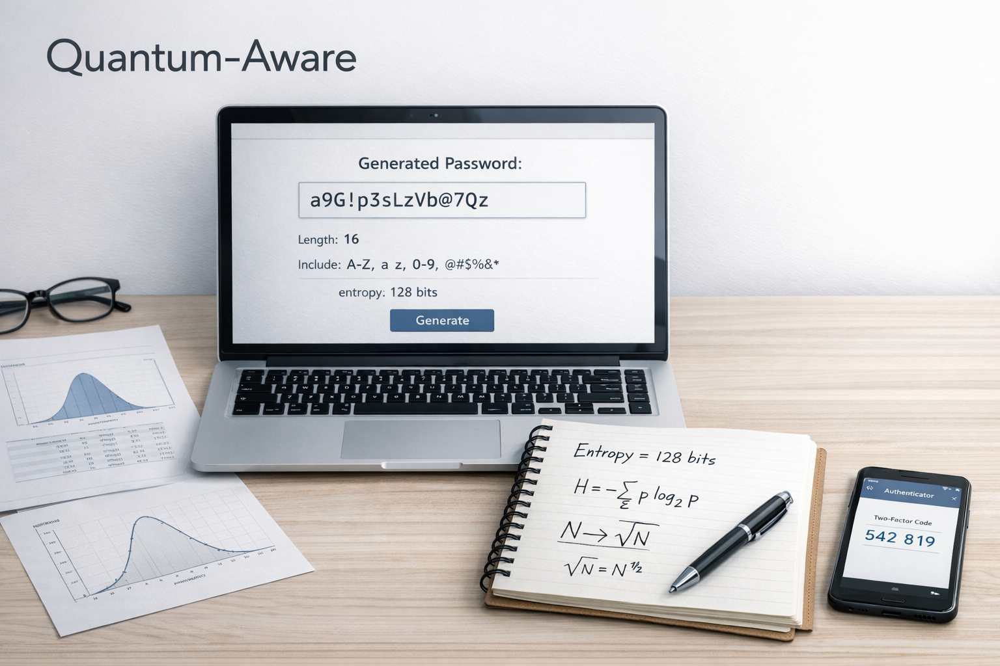

<h1 align="center">Quantum-Aware</h1>

<p align="center">

</p>

<p align="center">

  

  

  

  

</p>

# Quantum-Aware

Quantum-Aware is an open-source, local-only toolkit for generating high-entropy passwords, passphrases, and key material with conservative classical and quantum-aware brute-force estimates.

- GitHub repository: `https://github.com/milord-x/Quantum-Aware`
- GitHub Pages web app: `https://milord-x.github.io/Quantum-Aware/`
- npm package: `https://www.npmjs.com/package/quantum-aware`

It ships as:

- a browser-based web application
- a cross-platform terminal CLI
- a shared TypeScript core used by both

Quantum-Aware is intentionally careful about language. It does not claim to be quantum-proof, unbreakable, or a substitute for post-quantum public-key cryptography.

## Overview

Quantum-Aware focuses on a narrow but important problem: generating random values with strong entropy and explaining their brute-force cost in plain technical terms.

The project provides three generation modes:

- `Password`: configurable random character passwords
- `Passphrase`: word-based passphrases with formatting controls
- `Key Material`: random bytes encoded as hex, base64, or raw byte lists

For every generated value, Quantum-Aware reports:

- entropy (bits)
- search space size
- classical brute-force estimate
- conservative quantum-aware estimate
- strength label and explanatory notes

## Why entropy matters

Entropy is a compact way to describe uncertainty in bits. For random secret material, higher entropy means a larger search space and therefore more brute-force work for an attacker.

Examples used by the project:

- random passwords: `entropy = log2(charset_size) * length`
- passphrases: `entropy = log2(wordlist_size) * word_count`
- random bytes: `entropy = 8 * bytes`

These formulas depend on assumptions:

- randomness is cryptographically secure
- choices are close to uniform
- the attacker must guess offline rather than through a heavily rate-limited online form

Entropy is not the whole story. High-entropy passwords and keys can still be exposed by phishing, malware, clipboard capture, poor storage, or secret reuse.

## Classical brute-force model

Classical brute-force search scales as:

- `O(N)`

where `N` is the search space.

If a password has `k` possible symbols per position and length `L`, then the search space is roughly `k^L`. The expected number of guesses for a blind offline brute-force attack is on the order of half that space.

Quantum-Aware turns those estimates into readable output so users can compare configurations without inventing fake certainty.

## Quantum considerations

Quantum-Aware includes a conservative educational model for a quantum-computing threat model. The goal is not to predict future hardware precisely, but to avoid hand-waving about quantum risk.

### Grover's algorithm

For unstructured search, the standard intuition is:

- classical search: `O(N)`
- quantum search: `O(sqrt(N))`

or equivalently:

- `N -> sqrt(N)`

That means a sufficiently idealized Grover-style search can reduce brute-force scaling from linear in the search space to square-root in the search space.

In bit terms, people often summarize this as roughly halving the effective brute-force margin:

- `2^128` classical search space behaves more like about `2^64` Grover-style steps

This still leaves high-entropy values expensive to search. That is why increasing entropy remains useful even under a conservative quantum-computing threat model.

Important caveats:

- this is an educational approximation, not a claim about a ready-to-use attack
- practical attacks depend on fault tolerance, oracle construction, hardware scale, and protocol details
- Grover-style reasoning does not make brute-force free
- Quantum-Aware is not a post-quantum cryptography suite

## Security model

- local-only generation
- no backend required
- no analytics or telemetry
- no remote storage
- no logging of generated passwords, passphrases, keys, API keys, or recovery codes
- web randomness via `crypto.getRandomValues`
- CLI randomness via platform cryptographic randomness through Node.js

## Features

### Password generation

- configurable length
- lowercase, uppercase, digits, symbols
- exclude ambiguous characters
- avoid duplicates where possible
- require at least one character from each enabled class
- custom symbol set and full charset override
- multiple outputs and presets

### Passphrase generation

- configurable word count
- separator choice
- lowercase, capitalized, uppercase, or random capitalization
- optional digit and symbol prefixes or suffixes
- entropy estimate based on wordlist size and word count

### Key generation

- raw random bytes
- hex output
- base64 output
- byte-length presets for common use cases

### CLI

Global command:

```bash
qa generate password
qa generate passphrase
qa generate key
```

Supported flags include:

- `--length`
- `--words`
- `--bytes`
- `--preset`
- `--json`

## Project structure

```text
Quantum-Aware/
  apps/
    cli/
    web/
  docs/
  packages/
    core/
  .github/
    workflows/
  CONTRIBUTING.md
  LICENSE
  README.md
  SECURITY.md
```

## Local development

Requirements:

- Node.js 20+
- npm 10+
- Linux, macOS, or Windows

Install dependencies:

```bash
npm install
```

Run the web app:

```bash
npm run dev:web
```

Run the CLI help:

```bash
npm run dev:cli
```

Run tests:

```bash
npm test
```

Build everything:

```bash
npm run build
```

## Download and install

### Web app

Open the hosted web version:

```text
https://milord-x.github.io/Quantum-Aware/
```

### CLI from npm

Install globally:

```bash
npm install -g quantum-aware
```

Check that it works:

```bash
qa generate password --length 20
qa generate passphrase --words 6
qa generate key --bytes 32 --json
```

## GitHub Pages

The web app is configured for static hosting with Vite and can be deployed to GitHub Pages through the included workflow.

### Repository setup

1. Push the repository to GitHub as `Quantum-Aware`
2. In GitHub, open `Settings -> Pages`
3. Under `Build and deployment`, choose `GitHub Actions`
4. Push to the default branch; the workflow in `.github/workflows/deploy-pages.yml` will publish the web build

Current published Pages URL:

```text
https://milord-x.github.io/Quantum-Aware/
```

The Pages build uses:

- repository base path: `/Quantum-Aware/`
- static Vite output from `apps/web/dist`

Local Pages-style build:

```bash
VITE_BASE_PATH=/Quantum-Aware/ npm run build -w @quantum-aware/web
```

## npm distribution

The CLI package is prepared for npm publication under the package name `quantum-aware`.

Global install:

```bash
npm install -g quantum-aware
```

Package page:

```text
https://www.npmjs.com/package/quantum-aware
```

Usage:

```bash
qa generate password --length 20
qa generate passphrase --words 6 --json
qa generate key --bytes 32 --preset api-token
```

## Example commands

```bash
qa generate password --preset balanced --length 24
qa generate password --preset developer-strong --json
qa generate passphrase --words 5 --json
qa generate key --bytes 32 --json
qa analyze --mode password --length 20 --charset-size 72
qa presets list
```

## Limitations

Quantum-Aware helps with random generation and conservative brute-force estimates. It does not solve:

- phishing
- malware
- keyloggers
- clipboard leaks on compromised systems
- insecure storage
- secret reuse
- weak recovery flows in third-party services

Quantum-Aware is not quantum-proof. It is a practical, entropy-focused tool that uses conservative estimates for brute-force difficulty under classical and simplified quantum assumptions.

Additional technical notes live in:

- `docs/entropy-model.md`
- `docs/threat-model.md`
- `docs/limitations.md`

## Cross-platform notes

The project is designed to run on Linux, macOS, and Windows with no OS-specific runtime dependencies and no required global tools beyond Node.js and npm.

## License

MIT. See `LICENSE`.
